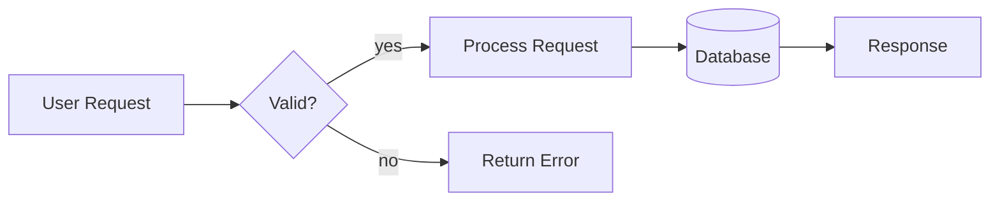
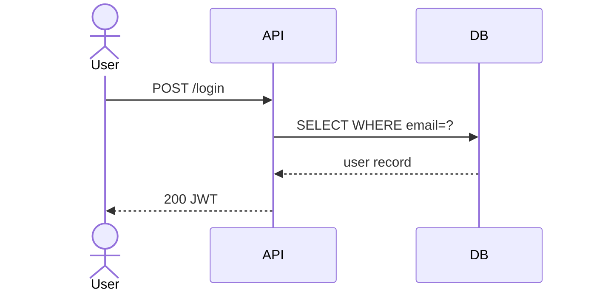
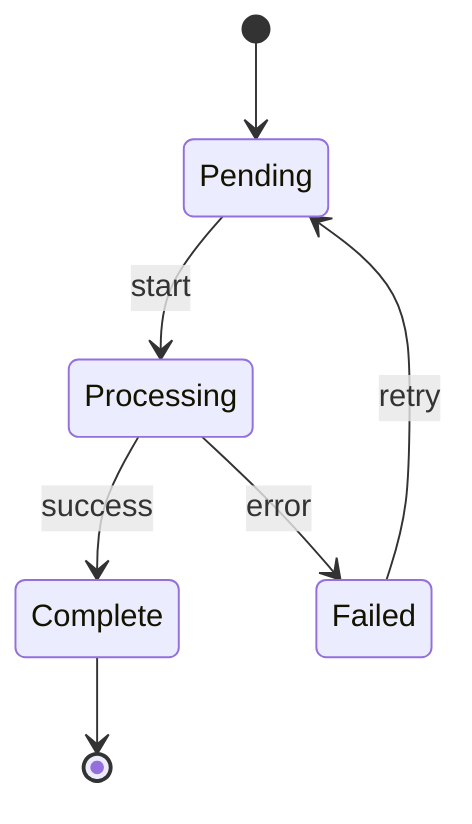
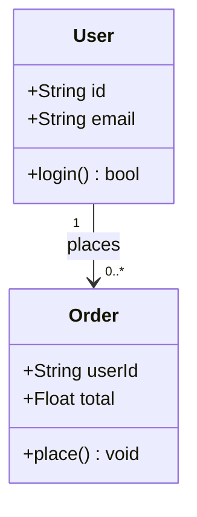
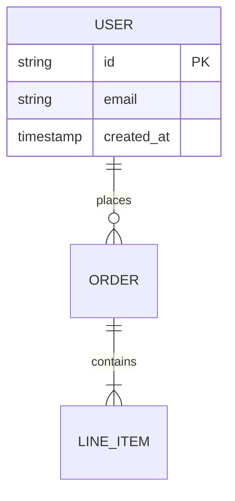

# Pretty Diagrams

Three-tier rendering stack for Mermaid diagrams: ASCII previews, themed SVG exports, and full-type fallback.

## When to Use

- User asks for an architecture diagram, flowchart, sequence, state, class, or ER diagram
- Need to visualize data flows, system relationships, processes, or state machines
- Embedding diagrams in docs, PRs, Obsidian, or terminal output
- User wants a "pretty" or "rendered" version, not just a code block

## Tool Selection

### By Output Context

| Context | Tool |
|---------|------|
| Terminal preview | `mmd-render --ascii` (flowchart/sequence only) |
| Pretty SVG export | `mmd-render` (beautiful-mermaid) |
| GitHub/Obsidian embed | Raw mermaid code block (rendered natively) |
| Unsupported diagram type | `mmdc` (mermaid CLI) |

### By Diagram Type

| Type | mmd-render SVG | mmd-render ASCII | mmdc |
|------|:--------------:|:----------------:|:----:|
| Flowchart | ✅ | ✅ | ✅ |
| Sequence | ✅ | ✅ | ✅ |
| State | ✅ | ❌ | ✅ |
| Class | ✅ | ❌ | ✅ |
| ER | ✅ | ❌ | ✅ |
| Gantt / Pie / Git / XY | ❌ | ❌ | ✅ |

**Default choice:** `mmd-render` for anything needing visual output. Use `--ascii` only when the user explicitly wants terminal output.

## Writing Mermaid Markup

### General Rules

- Keep to 10–15 nodes max — beyond that, split into multiple diagrams
- Always specify direction in flowcharts (`flowchart LR` not just `flowchart`)
- Use meaningful labels, not `A`, `B`, `C`
- Prefer `flowchart` over `graph` (newer syntax)

### Flowcharts

Use **LR** for pipelines/data flows, **TD** for hierarchies/trees.



Node shapes:
- `[text]` — rectangle
- `(text)` — rounded corners
- `{text}` — diamond / decision
- `[(text)]` — cylinder / database
- `([text])` — stadium / pill
- `[[text]]` — subroutine / double-border
- `{{text}}` — hexagon

Edge types:
- `-->` — arrow
- `---` — line (no arrow)
- `-.->` — dashed arrow
- `==>` — thick arrow
- `--> |label|` — labeled edge

### Sequence Diagrams



- Use `actor` for humans, `participant` for systems
- Keep to 3–5 participants — more gets unreadable
- `-->>` for return messages (dashed = response convention)

### State Diagrams



- Use `stateDiagram-v2` (not v1)
- `[*]` for entry/exit points
- Label transitions with `: event`

### Class Diagrams



Visibility prefixes: `+` public, `-` private, `#` protected

### ER Diagrams



Cardinality syntax: `||--o{` = one-to-many. Left side is the "one".

## Rendering

### mmd-render (primary)

`mmd-render` is installed at `~/bin/mmd-render`. It wraps beautiful-mermaid (SVG) and box-of-rain (ASCII).

```bash
# SVG — beautiful-mermaid, default tokyo-night theme
mmd-render diagram.mmd

# SVG — explicit output path + theme
mmd-render --theme nord diagram.mmd output.svg
open output.svg

# ASCII — box-of-rain (flowchart/sequence), falls back to beautiful-mermaid ASCII
mmd-render --ascii diagram.mmd

# Help
mmd-render --help
```

**Available themes:** `tokyo-night` · `dracula` · `catppuccin` · `nord` · `github` · `github-dark` (+ 9 more)

**Source:** `~/.local/share/mmd-render/index.ts` · Dependencies: `beautiful-mermaid`, `box-of-rain`

### Mermaid CLI (all types)

Use when diagram type isn't supported by mmd-render (Gantt, pie, git, xychart, etc.).

```bash
# Install once
bun add -g @mermaid-js/mermaid-cli

# Render
mmdc -i diagram.mmd -o diagram.svg
mmdc -i diagram.mmd -o diagram.png -t dark
mmdc -i diagram.mmd -o diagram.svg -w 1200
```

## Default Workflow

1. **Write** the Mermaid markup based on what the user describes
2. **Embed** a raw fenced code block in the response — works in GitHub, Obsidian, and most doc tools natively
3. **Offer** rendering options:
   - "Want me to render this as a themed SVG? (`mmd-render --theme nord diagram.mmd`)"
   - For flowchart/sequence: "Or an ASCII preview? (`mmd-render --ascii diagram.mmd`)"
4. **Save** `.mmd` to `docs/diagrams/` if working in a project codebase

## Anti-Patterns

- ❌ Using mmd-render SVG for Gantt/pie/git/xychart (not supported — use `mmdc`)
- ❌ Using mmd-render ASCII for state/class/ER (not supported — use SVG mode)
- ❌ Diagrams with 20+ nodes — split or summarize
- ❌ Bare letters as node names (`A --> B`) without labels
- ❌ Forgetting flowchart direction (`flowchart` without LR/TD/RL/BT)
- ❌ Using `graph` keyword instead of `flowchart` (legacy syntax)
