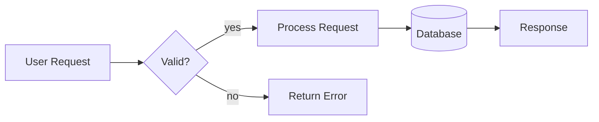
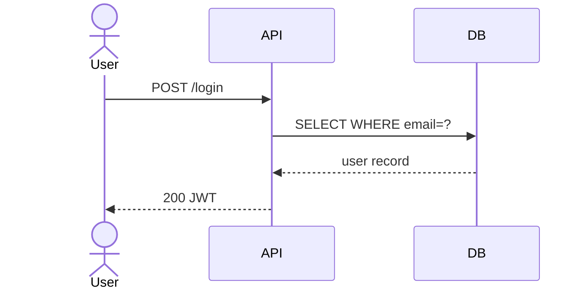
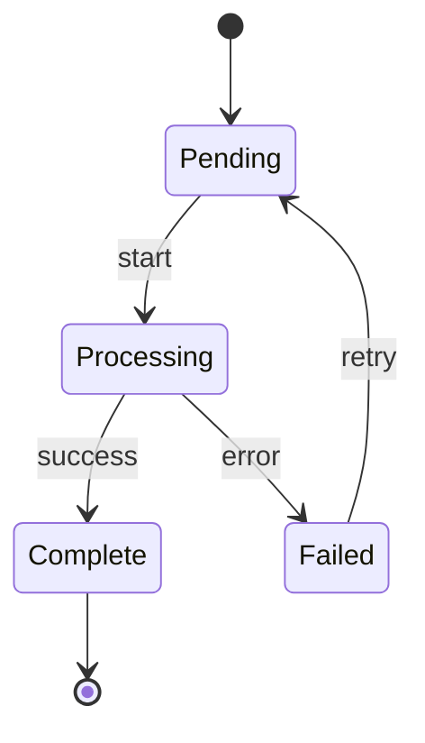
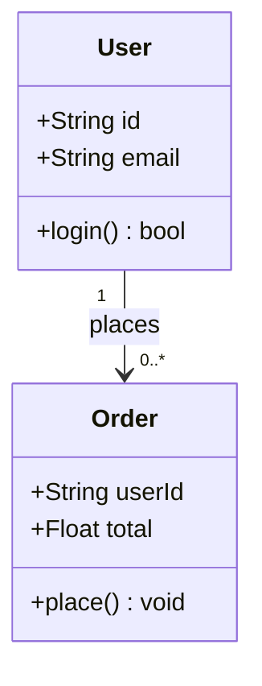
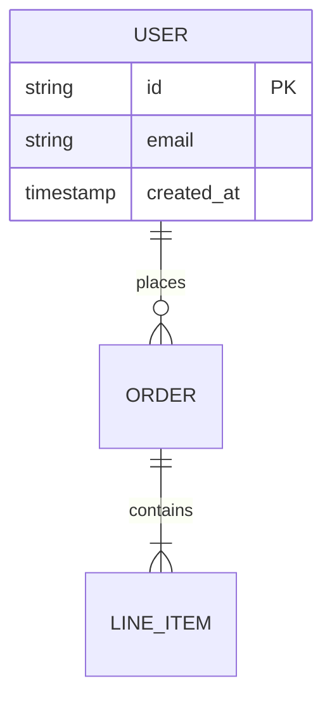

# Pretty Diagrams

Write clean Mermaid markup that renders natively in GitHub and Obsidian. Optionally render to ASCII (box-of-rain) or themed SVG (beautiful-mermaid) when explicitly requested.

## When to Use

- User asks for an architecture diagram, flowchart, sequence, state, class, or ER diagram
- Need to visualize data flows, system relationships, processes, or state machines
- Auditing or cleaning up existing mermaid diagrams in a codebase
- User explicitly asks for ASCII art or themed SVG rendering

## Choosing the Right Output

**Ask the user what they need.** Don't assume SVG. Walk through this decision:

### 1. Does the diagram live in a `.md` file viewed on GitHub or Obsidian?

**Yes** → Write a fenced mermaid code block. Done. No rendering needed.

### 2. Does the user want rendered output?

Ask: **"Do you want ASCII art, a themed SVG, or both?"**

### 3. Pick the tool based on diagram type and output format

**Preference order: box-of-rain first, beautiful-mermaid second, mmdc last.**

| Diagram Type | box-of-rain | beautiful-mermaid | mmdc (fallback) |
|--------------|:-----------:|:-----------------:|:---------------:|
| Flowchart | ✅ ASCII + SVG (shadows) | ✅ ASCII + SVG (themed) | ✅ |
| Sequence | ✅ ASCII + SVG | ✅ ASCII + SVG | ✅ |
| State | ❌ | ✅ SVG only | ✅ |
| Class | ❌ | ✅ SVG only | ✅ |
| ER | ❌ | ✅ SVG only | ✅ |
| Gantt / Pie / Git / XY | ❌ | ❌ | ✅ |

### Recommendations

- **Flowcharts and sequences** → Start with `box-of-rain`. It has a CLI, works with Node, and the shadow SVGs look great. If the diagram has deeply nested subgraphs or dotted edges (`-.->`) that render poorly, fall back to `beautiful-mermaid` which handles complex layouts better.
- **State, class, ER** → `beautiful-mermaid` (SVG only, no ASCII for these types). Requires bun.
- **Gantt, pie, git, xychart** → `mmdc` is the only option. These are niche types that the other tools don't support.

## Writing Mermaid Markup

### General Rules

- Keep to 10–15 nodes max — beyond that, split into multiple diagrams
- Always specify direction in flowcharts (`flowchart LR` not just `flowchart`)
- Use meaningful labels, not `A`, `B`, `C`
- Prefer `flowchart` over `graph` (newer syntax)

### Flowcharts

Use **LR** for pipelines/data flows, **TD** for hierarchies/trees.


```mermaid
flowchart LR
    Input[User Request] --> Validate{Valid?}
    Validate -->|yes| Process[Process Request]
    Validate -->|no| Error[Return Error]
    Process --> Store[(Database)]
    Store --> Output[Response]
```

Node shapes:
- `[text]` — rectangle
- `(text)` — rounded corners
- `{text}` — diamond / decision
- `[(text)]` — cylinder / database
- `([text])` — stadium / pill
- `[[text]]` — subroutine / double-border
- `{{text}}` — hexagon

Edge types:
- `-->` — arrow
- `---` — line (no arrow)
- `-.->` — dashed arrow
- `==>` — thick arrow
- `--> |label|` — labeled edge

### Sequence Diagrams


```mermaid
sequenceDiagram
    actor User
    participant API
    participant DB

    User->>API: POST /login
    API->>DB: SELECT WHERE email=?
    DB-->>API: user record
    API-->>User: 200 JWT
```

- Use `actor` for humans, `participant` for systems
- Keep to 3–5 participants — more gets unreadable
- `-->>` for return messages (dashed = response convention)

### State Diagrams


```mermaid
stateDiagram-v2
    [*] --> Pending
    Pending --> Processing : start
    Processing --> Complete : success
    Processing --> Failed : error
    Failed --> Pending : retry
    Complete --> [*]
```

- Use `stateDiagram-v2` (not v1)
- `[*]` for entry/exit points
- Label transitions with `: event`

### Class Diagrams


```mermaid
classDiagram
    class User {
        +String id
        +String email
        +login() bool
    }
    class Order {
        +String userId
        +Float total
        +place() void
    }
    User "1" --> "0..*" Order : places
```

Visibility prefixes: `+` public, `-` private, `#` protected

### ER Diagrams


```mermaid
erDiagram
    USER ||--o{ ORDER : places
    ORDER ||--|{ LINE_ITEM : contains
    USER {
        string id PK
        string email
        timestamp created_at
    }
```

Cardinality syntax: `||--o{` = one-to-many. Left side is the "one".

## Rendering (only when requested)

### box-of-rain (ASCII + SVG CLI)

Has a CLI. Works with Node. Best for quick ASCII previews and shadow-effect SVGs.

```bash
# Install
npm install -g box-of-rain

# ASCII (flowchart/sequence only)
box-of-rain diagram.mmd

# SVG with shadows
box-of-rain --svg diagram.mmd > diagram.svg
```

### beautiful-mermaid (ASCII + themed SVG library)

No CLI — requires bun. Better ASCII quality than box-of-rain for nested subgraphs and dotted edges. 15 built-in themes.

```bash
# Install (requires bun)
bun add beautiful-mermaid  # in a temp dir or project

# Render via bun -e
bun -e "
import { renderMermaidSVG, renderMermaidAscii, THEMES } from 'beautiful-mermaid';
import { readFileSync, writeFileSync } from 'fs';

const src = readFileSync('diagram.mmd', 'utf8');

// Themed SVG
const svg = renderMermaidSVG(src, { theme: THEMES.tokyoNight });
writeFileSync('diagram.svg', svg);

// ASCII
console.log(renderMermaidAscii(src));
"
```

**Themes:** `tokyoNight` · `dracula` · `catppuccin` · `nord` · `github` · `githubDark` (+ 9 more via `THEMES`)

**Key exports:** `renderMermaidSVG`, `renderMermaidAscii`, `renderMermaidSync`, `parseMermaid`, `THEMES`, `fromShikiTheme`

### Mermaid CLI (all diagram types)

Fallback for types beautiful-mermaid and box-of-rain don't support (Gantt, pie, git, xychart).

```bash
npm install -g @mermaid-js/mermaid-cli
mmdc -i diagram.mmd -o diagram.svg
mmdc -i diagram.mmd -o diagram.png -t dark
```

## Audit Workflow

When cleaning up existing diagrams in a codebase:

1. **Find all diagrams** — `grep -r '```mermaid' docs/` and `find . -name '*.mmd'`
2. **Check for legacy syntax** — `graph` keyword, single-letter IDs, oversized flowcharts
3. **Fix markup in place** — the fenced code blocks in `.md` files are the deliverable
4. **Sync `.mmd` source files** with inline counterparts (if both exist)
5. **Remove committed SVGs** if GitHub renders the mermaid natively
6. **Do NOT generate SVGs** unless the user explicitly asks

### Common Fixes

| Problem | Fix |
|---------|-----|
| `graph LR` / `graph TB` | `flowchart LR` / `flowchart TB` |
| `A[Label] --> B[Label]` | `Input[Label] --> Process[Label]` (descriptive IDs) |
| 20+ nodes in one diagram | Split by concern, move error details to companion tables |
| `style A fill:#ffd` after renaming A | Update style refs to match new node IDs |
| Unquoted `<br/>` in flowchart labels | Quote: `Node["Line 1<br/>Line 2"]` |
| Duplicate `.mmd` + inline block | Pick one source of truth, delete the other |

## Default Workflow

1. **Write** clean Mermaid markup with descriptive node IDs
2. **Embed** in a fenced code block — GitHub and Obsidian render it natively
3. **Save** `.mmd` to `docs/diagrams/` if the project uses standalone diagram files
4. **Ask** if they want rendered output: "Want me to render this as ASCII or a themed SVG?"
5. **If yes**, follow the tool selection in "Choosing the Right Output" — box-of-rain first, beautiful-mermaid if needed, mmdc as last resort

## Anti-Patterns

- Defaulting to SVG rendering when the user just wants a diagram in their docs
- Generating SVGs and committing them alongside `.mmd` source (redundant, drifts)
- Diagrams with 20+ nodes — split or summarize
- Bare letters as node names (`A --> B`) without descriptive labels
- Forgetting flowchart direction (`flowchart` without LR/TD/RL/BT)
- Using `graph` keyword instead of `flowchart` (legacy syntax)
- Encoding every error branch in a flowchart when a table does it better
